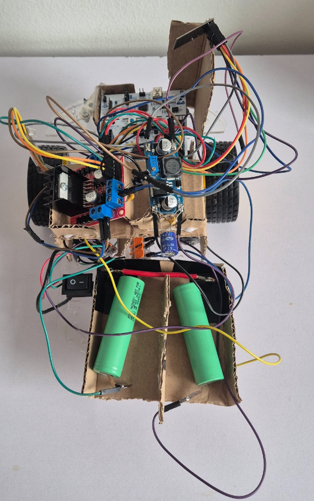

# STM32 nRF24 RC Car

STM32-based wireless RC car controlled via joystick input and nRF24L01 communication.

## Features

* Wireless communication using nRF24L01 modules
* Custom transmitter and receiver firmware
* Arcade-style joystick control using differential drive
* Real-time control with continuous wireless data transmission
* PWM-based motor speed control

## How It Works

The system consists of two STM32-based modules:

* **Transmitter (remote_tx)**
  Reads joystick input (X and Y axes) and sends the data wirelessly using the nRF24L01 module.

* **Receiver (car_rx)**
  Receives joystick data and controls the motors using PWM signals.
  Differential drive logic is used to convert joystick input into left and right motor speeds.

## Project Structure

* `remote_tx/` – transmitter firmware (joystick controller)
* `car_rx/` – receiver firmware (car control)

## Hardware

* STM32 Nucleo board (receiver, mounted on car)
* STM32 Discovery board (transmitter, remote controller)
* nRF24L01 wireless modules
* L298N motor driver with DC motors
* LM2596 buck converter (power regulation)
* Li-ion batteries (power supply)
* Analog joystick module

## Future Improvements
- Design and 3D print a custom chassis/enclosure
- Replace prototype wiring with soldered connections (PCB or perfboard)
- Improve wiring layout for better reliability and noise reduction

## Prototype

